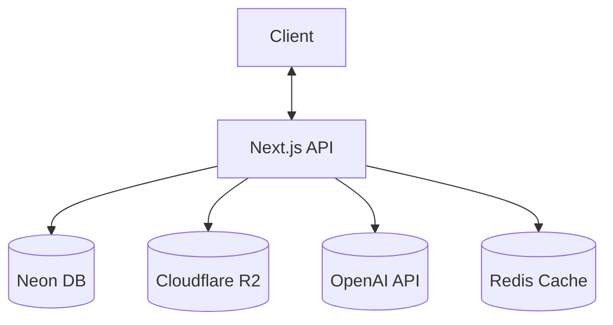
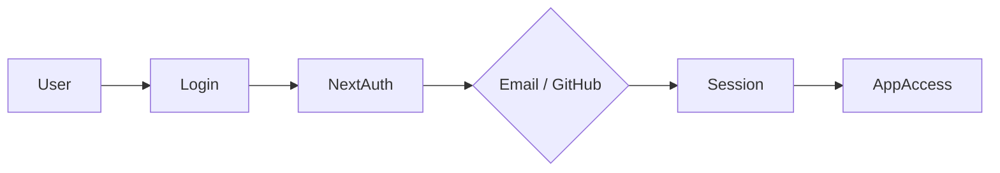
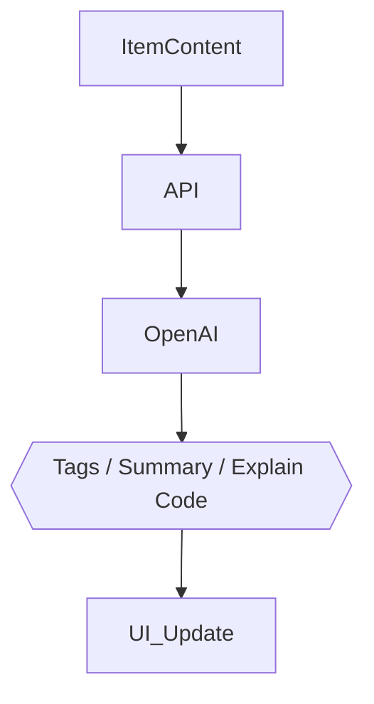

# 🏗️ DevStash — Project Overview

**Store Smarter. Build Faster.**

A centralized, AI-enhanced knowledge hub for developers — snippets, prompts, docs, commands, and more, in one searchable place.

**Status:** 🟡 In planning — ready for environment setup & UI scaffolding

---

## 📑 Table of Contents

1. [Problem](#-problem)
2. [Users](#-users)
3. [Core Features](#-core-features)
4. [Data Model](#️-data-model)
5. [Tech Stack](#-tech-stack)
6. [Monetization](#-monetization)
7. [UI / UX](#-ui--ux)
8. [Architecture Diagrams](#-architecture-diagrams)
9. [Development Workflow](#-development-workflow)
10. [Roadmap](#-roadmap)
11. [Open Questions & Risks](#-open-questions--risks)

---

## 🎯 Problem

Developers keep their essentials scattered across too many tools:

| Scattered today   | Lives in                  |
| ----------------- | ------------------------- |
| Code snippets     | VS Code, Notion           |
| AI prompts        | Chat histories            |
| Context files     | Buried in random projects |
| Useful links      | Browser bookmarks         |
| Docs              | Random folders            |
| Commands          | `.txt` files              |
| Project templates | GitHub Gists              |
| Terminal commands | Bash history              |

This fragmentation causes **context switching, lost knowledge, and inconsistent workflows.**

> **DevStash provides ONE searchable, AI-enhanced hub for all dev knowledge & resources.**

---

## 🧑‍💻 Users

| Persona                       | Needs                                     |
| ----------------------------- | ----------------------------------------- |
| 👩‍💻 Everyday Developer         | Quick access to snippets, commands, links |
| 🤖 AI-First Developer         | Store prompts, workflows, contexts        |
| 🎓 Content Creator / Educator | Save course notes, reusable code          |
| 🧱 Full-Stack Builder         | Patterns, boilerplates, API references    |

---

## ✨ Core Features

### A) Items & System Item Types

Every item belongs to a built-in type:

- 📄 Snippet
- 💬 Prompt
- 📝 Note
- ⌨️ Command
- 📁 File
- 🖼️ Image
- 🔗 URL

> Custom item types are a **Pro** feature.

### B) Collections

Group items together — mixed item types allowed within a single collection.

Examples: _React Patterns · Context Files · Python Snippets_

### C) Search

Full-text search across:

- Content
- Tags
- Titles
- Types

### D) Authentication

- Email + Password
- GitHub OAuth

### E) Additional Features

- ⭐ Favorites & pinned items
- 🕒 Recently used
- 📥 Import from files
- ✍️ Markdown editor for text items
- 📎 File uploads (images, docs, templates)
- 📤 Export (JSON / ZIP)
- 🌙 Dark mode (default)

### F) AI Superpowers _(Pro)_

- 🏷️ Auto-tagging
- 📋 AI summaries
- 🧠 Explain Code
- ✨ Prompt optimization

> AI powered by **OpenAI gpt-5-nano**

---

## 🗄️ Data Model

> Rough Prisma draft — expected to evolve as features are built.

```prisma
model User {
  id                   String       @id @default(cuid())
  email                String       @unique
  password             String?
  isPro                Boolean      @default(false)
  stripeCustomerId     String?
  stripeSubscriptionId String?

  items                Item[]
  itemTypes            ItemType[]
  collections          Collection[]
  tags                 Tag[]

  createdAt            DateTime     @default(now())
  updatedAt            DateTime     @updatedAt
}

model Item {
  id           String      @id @default(cuid())
  title        String
  contentType  String      // "text" | "file"
  content      String?     // used for text-based types
  fileUrl      String?
  fileName     String?
  fileSize     Int?
  url          String?
  description  String?
  isFavorite   Boolean     @default(false)
  isPinned     Boolean     @default(false)
  language     String?     // for syntax highlighting

  userId       String
  user         User        @relation(fields: [userId], references: [id])

  typeId       String
  type         ItemType    @relation(fields: [typeId], references: [id])

  collectionId String?
  collection   Collection? @relation(fields: [collectionId], references: [id])

  tags         ItemTag[]

  createdAt    DateTime    @default(now())
  updatedAt    DateTime    @updatedAt

  @@index([userId])
  @@index([collectionId])
}

model ItemType {
  id       String   @id @default(cuid())
  name     String
  icon     String?
  color    String?
  isSystem Boolean  @default(false) // true for built-in types (Snippet, Prompt, etc.)

  userId   String?  // null for system types, set for user-defined Pro types
  user     User?    @relation(fields: [userId], references: [id])

  items    Item[]
}

model Collection {
  id          String   @id @default(cuid())
  name        String
  description String?
  isFavorite  Boolean  @default(false)

  userId      String
  user        User     @relation(fields: [userId], references: [id])

  items       Item[]

  createdAt   DateTime @default(now())
  updatedAt   DateTime @updatedAt
}

model Tag {
  id     String    @id @default(cuid())
  name   String
  userId String
  user   User      @relation(fields: [userId], references: [id])
  items  ItemTag[]

  @@unique([userId, name])
}

model ItemTag {
  itemId String
  tagId  String

  item Item @relation(fields: [itemId], references: [id])
  tag  Tag  @relation(fields: [tagId], references: [id])

  @@id([itemId, tagId])
}
```

**Notes / things to confirm before locking the schema:**

- Added `@@unique([userId, name])` on `Tag` and `@@index` on `Item` — worth confirming since tag names should probably be unique per user, and item lookups by user/collection will be frequent.
- Consider `onDelete` behavior for relations (e.g. what happens to `Item`s when a `Collection` is deleted — cascade vs. set null).
- Free-tier limits (50 items / 3 collections) will need to be enforced in application logic, not the schema itself.

---

## 🧱 Tech Stack

| Category     | Choice                            |
| ------------ | --------------------------------- |
| Framework    | **Next.js (React 19)**            |
| Language     | TypeScript                        |
| Database     | Neon PostgreSQL + Prisma ORM      |
| Caching      | Redis _(optional)_                |
| File Storage | Cloudflare R2                     |
| CSS / UI     | Tailwind CSS v4 + ShadCN          |
| Auth         | NextAuth v5 (email + GitHub)      |
| AI           | OpenAI gpt-5-nano                 |
| Payments     | Stripe (subscriptions + webhooks) |
| Deployment   | Vercel _(likely)_                 |
| Monitoring   | Sentry _(later)_                  |

---

## 💰 Monetization

| Plan     | Price           | Limits                  | Features                                        |
| -------- | --------------- | ----------------------- | ----------------------------------------------- |
| **Free** | $0              | 50 items, 3 collections | Basic search, image uploads, no AI              |
| **Pro**  | $8/mo or $72/yr | Unlimited               | File uploads, custom types, AI features, export |

> Stripe handles subscriptions; webhooks keep `isPro` / subscription status in sync with the database.

---

## 🎨 UI / UX

- 🌙 Dark mode first
- Minimal, developer-friendly UI
- Syntax highlighting for code
- Inspired by **Notion, Linear, Raycast**

### Layout

- Collapsible sidebar with filters & collections
- Main grid/list workspace
- Full-screen item editor

### Screenshots

Refer to the screenshots below as a base for the dashboard UI. It does not have be exact. use it as a refrence:

- @context/screenshots/dashboard-ui-drawer.png
- @context/screenshots/dashboard-ui-main.png

### Responsive

- Mobile drawer for sidebar
- Touch-optimized icons and buttons

---

## 🔌 Architecture Diagrams

### API Architecture



### Auth Flow



### AI Feature Flow



---

## 🗂️ Development Workflow _(For Course)_

- One branch per lesson — students can follow along & compare
- Use **Cursor / Claude Code / ChatGPT** for assistance
- Sentry for runtime monitoring & error tracking
- GitHub Actions _(optional, for CI)_

**Branch example:**

```bash
git switch -c lesson-01-setup
```

---

## 🧭 Roadmap

### MVP

- [ ] Items CRUD
- [ ] Collections
- [ ] Search
- [ ] Basic tags
- [ ] Free tier limits

### Pro Phase

- [ ] AI features
- [ ] Custom item types
- [ ] File uploads
- [ ] Export
- [ ] Billing & upgrade flow

### Future Enhancements

- [ ] Shared collections
- [ ] Team / Org plans
- [ ] VS Code extension
- [ ] Browser extension
- [ ] API + CLI tool

---

## ❓ Open Questions & Risks

A few things worth deciding before or during MVP build-out:

- **Rate limiting on AI features** — gpt-5-nano calls should probably be throttled per-user (especially on Free, if any AI is exposed there at all) to control cost.
- **File size / type limits** — not yet specified for uploads to R2; worth defining early (e.g. max file size per plan tier).
- **Search implementation** — Postgres full-text search vs. a dedicated engine (e.g. Meilisearch/Typesense) if search needs to scale or support fuzzy matching.
- **Cascade behavior** — what happens to items/tags when a collection or tag is deleted.
- **Custom item type limits** — should Pro users have a cap on custom types, or truly unlimited?
- **Redis** — currently optional; worth deciding what it caches first (sessions? search results? AI response caching?) so it's not added speculatively.

---

## 🔗 Reference Links

- Next.js — https://nextjs.org
- Prisma — https://www.prisma.io
- Neon — https://neon.tech
- Cloudflare R2 — https://developers.cloudflare.com/r2
- NextAuth — https://authjs.dev
- Tailwind CSS — https://tailwindcss.com
- ShadCN UI — https://ui.shadcn.com
- Stripe — https://stripe.com/docs
- Sentry — https://sentry.io
